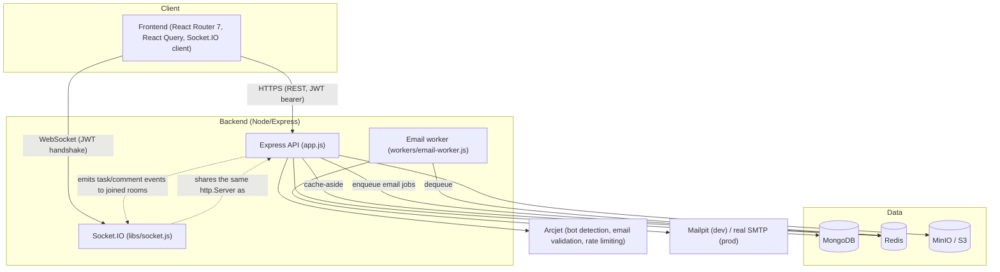
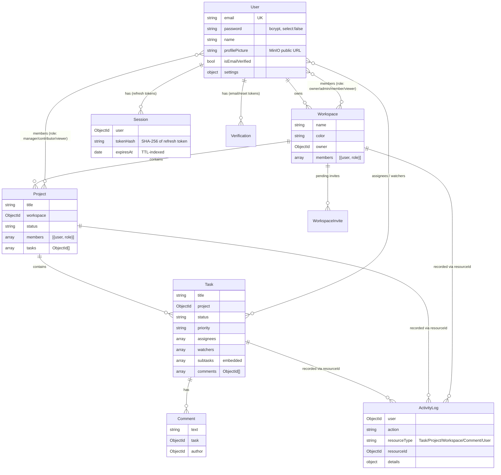

# TaskSync — Architecture

This document covers the system architecture, data model, RBAC design, and the key scaling/design trade-offs made while building this project. It's meant to be readable on its own (for an interview walkthrough) and to stay in sync with the actual code — see `ENGINEERING_ROADMAP.md` for the phase-by-phase history of *why* each piece was built.

## 1. System overview



**Why this shape:**
- **Socket.IO shares the backend's `http.Server`** (see `index.js`) rather than running as a separate service — one process, one deploy unit, and it can reuse the same JWT verification logic as the REST API's `authMiddleware`.
- **Redis is used for two unrelated things (cache + queue)** rather than standing up separate infrastructure for each, because both are genuinely lightweight at this scale and Redis is already free/self-hosted either way. The trade-off: `libs/cache.js` has to defend itself against the queue's connection settings (`maxRetriesPerRequest: null`, required by BullMQ) — see the fail-open design below.
- **The email worker is a separate process/container**, not inline code the API calls directly, specifically so a slow or down SMTP server can never add latency to a `register`/`login`/`invite` HTTP response.

## 2. Data model



**Notable design choices:**
- **`ActivityLog.resourceId` is generic** (not a typed reference to a specific collection) so one collection can log activity across every resource type. The cost: querying "all activity for project X" requires first gathering the project's own id plus every task id within it (`controllers/project.js#getProjectActivity`), rather than a single indexed foreign-key lookup. This was an acceptable trade-off for how infrequently that query runs (a manually-opened audit log dialog, not a hot path).
- **`Project.members` and `Workspace.members` are separate arrays with different role enums** (`manager/contributor/viewer` vs `owner/admin/member/viewer`) rather than one shared membership model. This is deliberate: workspace membership answers "can this person see the workspace and its projects at all," while project membership answers "what can they actually do with tasks in this specific project" — a workspace owner is **not** automatically a project member, so workspace-level and project-level RBAC (`libs/permissions.js`) can be reasoned about independently. The practical implication (and a real UX sharp edge worth knowing about): a user who creates a project has to explicitly add themselves as a project member, or they'll be locked out of their own project by the same RBAC rules everyone else follows.
- **`Session` stores a hash, never the raw refresh token**, using SHA-256 rather than bcrypt — bcrypt silently truncates input past 72 bytes, which would be a real (and quiet) bug against a ~200-character JWT. See Phase 4 in the roadmap for the full reasoning and the reuse-detection/rotation design built on top of it.

## 3. RBAC model

Two independent permission matrices (`backend/libs/permissions.js`), enforced by middleware attached at the route level (`workspace-permission.js`, `project-permission.js`, `task-permission.js`) rather than checked ad hoc inside controllers.

### Workspace roles

| Permission | Owner | Admin | Member | Viewer |
|---|---|---|---|---|
| View workspace | ✅ | ✅ | ✅ | ✅ |
| Edit workspace | ✅ | ✅ | ❌ | ❌ |
| Delete / archive workspace | ✅ | ❌ | ❌ | ❌ |
| Invite / remove members, change roles | ✅ | ✅ (invite/remove only) | ❌ | ❌ |
| Transfer ownership | ✅ | ❌ | ❌ | ❌ |
| Create / edit / archive projects | ✅ | ✅ | ❌ | ❌ |
| Comment / update assigned tasks / upload attachments | ✅ | ✅ | ✅ | ❌ |

### Project roles

| Permission | Manager | Contributor | Viewer |
|---|---|---|---|
| View project | ✅ | ✅ | ✅ |
| Edit / archive project, manage members, update deadline/status | ✅ | ❌ | ❌ |
| Create tasks | ✅ | ✅ | ❌ |
| Update **any** task | ✅ | ❌ | ❌ |
| Update **assigned** task only | ✅ (implied) | ✅ | ❌ |
| Assign task members | ✅ | ❌ | ❌ |
| Archive / delete task | ✅ | ❌ | ❌ |
| Comment on tasks | ✅ | ✅ | ❌ |

The Manager-vs-Contributor distinction on task updates is the one place the permission matrix alone isn't enough — "can edit any task" and "can edit only tasks assigned to them" both need to know about the *specific task*, not just the role. That logic lives in `middleware/task-permission.js#requireTaskUpdatePermission`, which checks `UPDATE_ANY_TASK` first and falls back to `UPDATE_ASSIGNED_TASK` + an assignee check.

**A concrete bug this design fixed:** before Phase 2, task routes had no permission checks at all beyond "logged in" — several had none whatsoever, and the rest only checked project *membership*, not role, so a viewer could edit and archive tasks. The table above is what's actually enforced now, verified by `backend/tests/integration/rbac.test.js`.

## 4. Scaling & design trade-offs

**Why Redis for both caching and background jobs, not just one:** they're genuinely different workloads (ephemeral cache-aside data vs. durable job queue) but both are free to run as a single container locally, and BullMQ requires Redis anyway — introducing a second piece of infrastructure (e.g. a separate queue broker) to keep the two "pure" would have been infrastructure for its own sake, not because the workloads demanded it at this scale.

**Why cache reads/writes race against a timeout and fail open (`libs/cache.js`):** Redis is configured with `maxRetriesPerRequest: null` (a BullMQ requirement for its blocking connections), which means a command issued while Redis is unreachable queues forever rather than rejecting. Without a timeout, a Redis blip would hang *every* request that touches the cache — including task creation, which has nothing to do with caching and shouldn't be able to fail because of it. A cache is an optimization; it should never be a single point of failure for functionality that works fine without it.

**Why MinIO instead of local disk for uploads:** local disk storage doesn't survive a container restart and doesn't work at all once there's more than one backend instance. MinIO speaks the real S3 API, so the same `libs/storage.js` code would work unchanged against real AWS S3 in production — the only change needed is environment variables.

**Why Socket.IO rooms are scoped per-project (and per-workspace), not a single global broadcast:** a global broadcast would mean every connected client receives every event system-wide and filters client-side — wasteful, and a real information-leak risk (a client could observe events for projects it has no access to, even if the UI never renders them). Instead, joining a room requires the same membership check the HTTP RBAC middleware performs (`libs/socket.js`), so the authorization boundary is consistent whether data arrives over REST or over a live socket event.

**Why the email worker is a separate container instead of an in-process queue:** so it can be scaled, restarted, or have its logs inspected independently of the API process, and so a worker crash (e.g. a bad SMTP response) can't take down request handling.

## 5. Directory structure (backend)

```
backend/
├── app.js              # Express app: middleware, routes, error handling (no DB connect/listen - importable by tests)
├── index.js             # Bootstraps DB connection, MinIO, Socket.IO, and starts the HTTP server
├── controllers/         # Route handlers - thin, delegate to models/libs
├── middleware/           # auth, RBAC (workspace/project/task-permission), error handling
├── models/               # Mongoose schemas
├── libs/                 # env validation, logger, metrics, cache, redis, storage, socket, token, swagger
├── queues/ + workers/     # BullMQ email queue and its standalone worker process
├── routes/                # Express routers, annotated with @openapi JSDoc (see /api-docs)
└── tests/                 # Vitest: unit (permissions, tokens) + integration (auth, RBAC, task CRUD)
```
